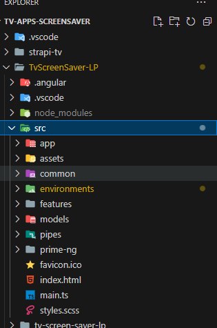
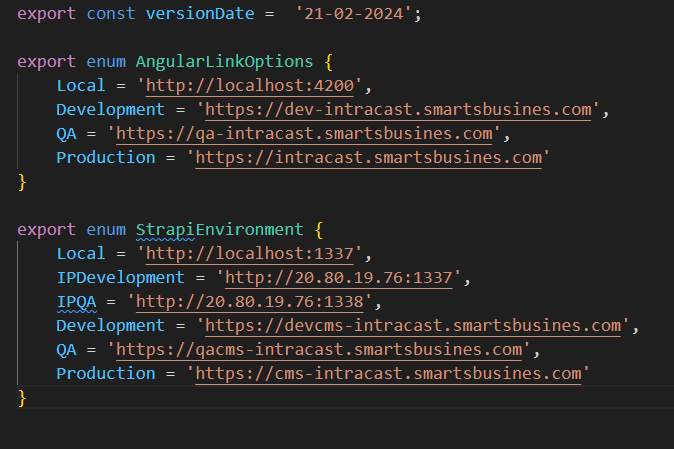
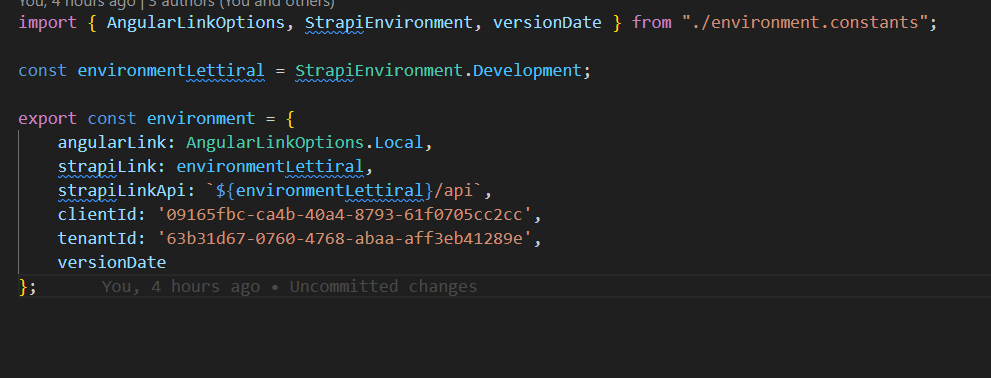
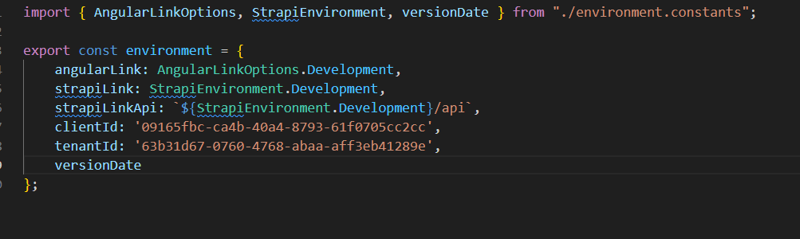
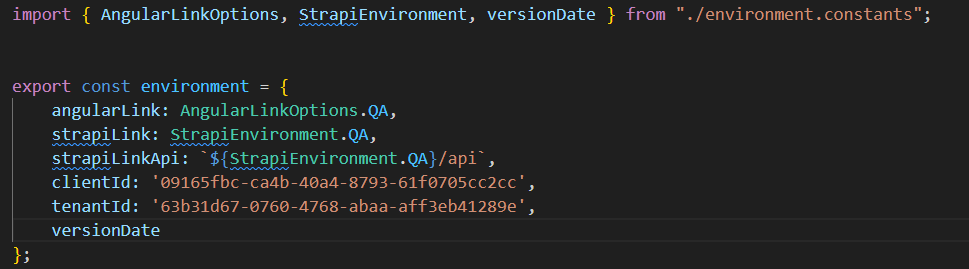
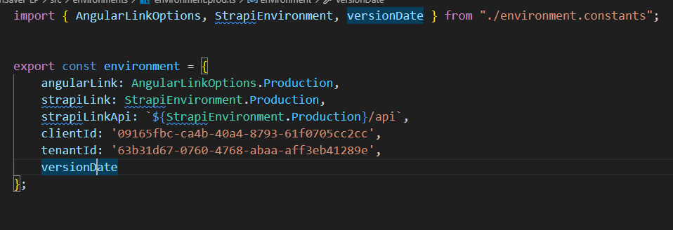
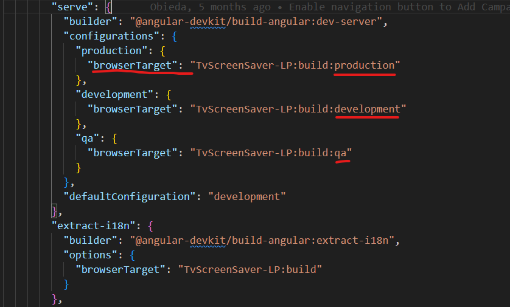

# Environment-Config

## How to use environments in Angular.

1- Create environment folder within src folder.  

  

2- Inside environment folder create all type of environments files.  

  

3- Inside the `environment.constants.ts` we will add all constants variables and url's  
 

4-The `environment.ts` file represents the default environment. 

environment.ts 


 

5-After config the development,prod and qa environments files.  
   - `environment.dev.ts`  
      
  -  `environment.qa.ts`  
      
  -  `environment.prod.ts`  
      

6- We will config the `angular.json` file and add the new environments inside it, inside the configurations property 
we will add the fileReplacements property. 

```js
"fileReplacements": [
    {
        "replace": "src/environments/environment.ts",
        "with": "src/environments/environment.prod.ts"
    }
```  
  

7- Now If you want to apply it on serve mode, within the 'server' property add the environments.



### Order to run the production or QA mode
```js
 // For production, you can change the name production for anything you want like prod and the command will be `ng serve --configuration=prod`, keep in mind the angular file very sensitive.

ng serve --configuration=production

// For QA 
ng serve --configuration=qa


```
### For building 
```js
ng build --configuration development
ng serve --configuration production
ng test --configuration qa
```


        